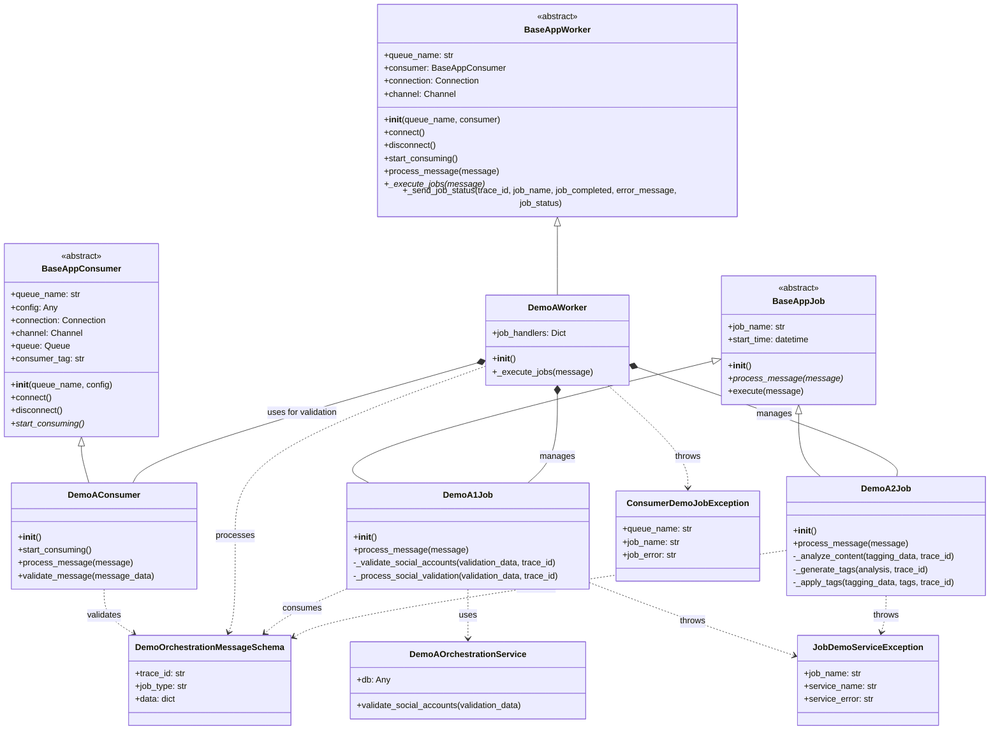
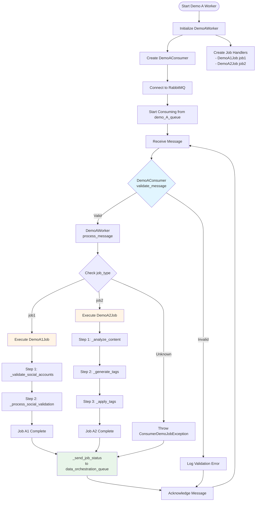
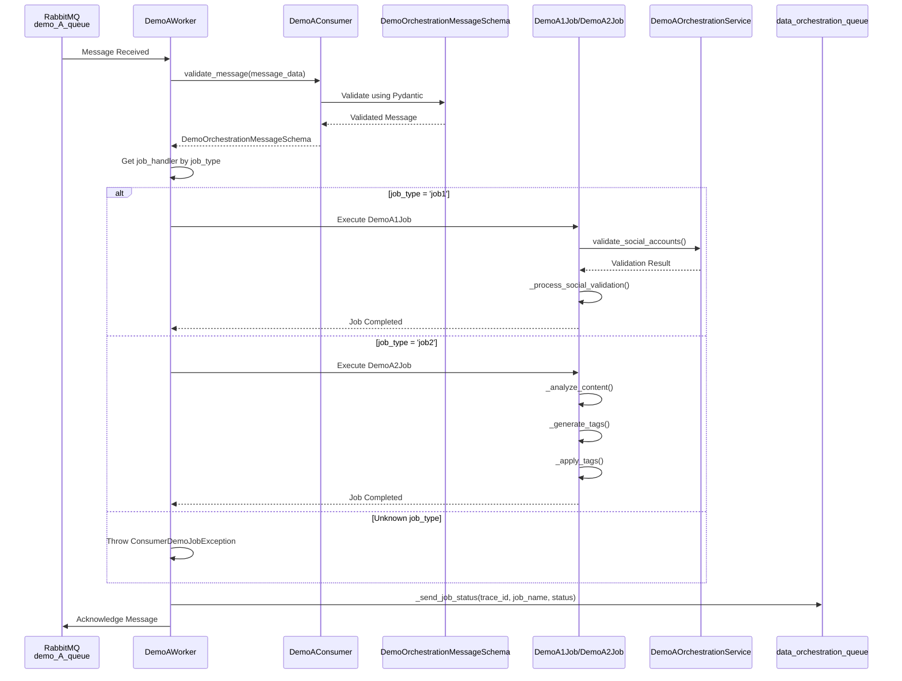

# Demo A - Consumer Worker Job Architecture

## Mermaid Class Diagram

## Flow Diagram

## Sequence Diagram

## Component Overview

### 1. **Base Classes**

#### BaseAppConsumer
- Abstract base class for all consumers
- Handles RabbitMQ connection management
- Provides queue declaration and connection lifecycle

#### BaseAppWorker
- Abstract base class for all workers
- Orchestrates consumer validation and job execution
- Manages message processing workflow

#### BaseAppJob
- Abstract base class for all jobs
- Provides execution framework with error handling
- Tracks job execution metrics

### 2. **Demo A Components**

#### DemoAConsumer
- **Purpose**: Validates messages from `demo_A_queue`
- **Functions**:
  - `__init__()`: Initialize consumer with queue name
  - `start_consuming()`: Start consuming messages
  - `process_message(message)`: Process incoming messages
  - `validate_message(message_data)`: Validate using schema

#### DemoAWorker
- **Purpose**: Orchestrates message validation and job execution
- **Functions**:
  - `__init__()`: Initialize with consumer and job handlers
  - `_execute_jobs(message)`: Route to appropriate job based on job_type

#### DemoA1Job (Social Validation)
- **Purpose**: Handle job_type='job1' - Social validation workflow
- **Functions**:
  - `process_message(message)`: Main processing logic
  - `_validate_social_accounts()`: Validate social accounts
  - `_process_social_validation()`: Process validation results

#### DemoA2Job (Auto Tagging)
- **Purpose**: Handle job_type='job2' - Auto tagging workflow
- **Functions**:
  - `process_message(message)`: Main processing logic
  - `_analyze_content()`: Analyze content for tags
  - `_generate_tags()`: Generate tags from analysis
  - `_apply_tags()`: Apply generated tags

### 3. **Data Flow**

1. **Message Reception**: Worker receives message from `demo_A_queue`
2. **Validation**: DemoAConsumer validates message using DemoOrchestrationMessageSchema
3. **Routing**: DemoAWorker routes to job handler based on `job_type`
4. **Execution**: Selected job (DemoA1Job or DemoA2Job) executes
5. **Status Reporting**: Worker sends job status to `data_orchestration_queue`
6. **Acknowledgment**: Message is acknowledged in RabbitMQ

### 4. **Error Handling**

- **Validation Errors**: Caught by DemoAConsumer, message logged and skipped
- **Job Errors**: Wrapped in `JobDemoServiceException` by individual jobs
- **Worker Errors**: Wrapped in `ConsumerDemoJobException` by worker
- **Final Status**: All errors reported to `data_orchestration_queue`
